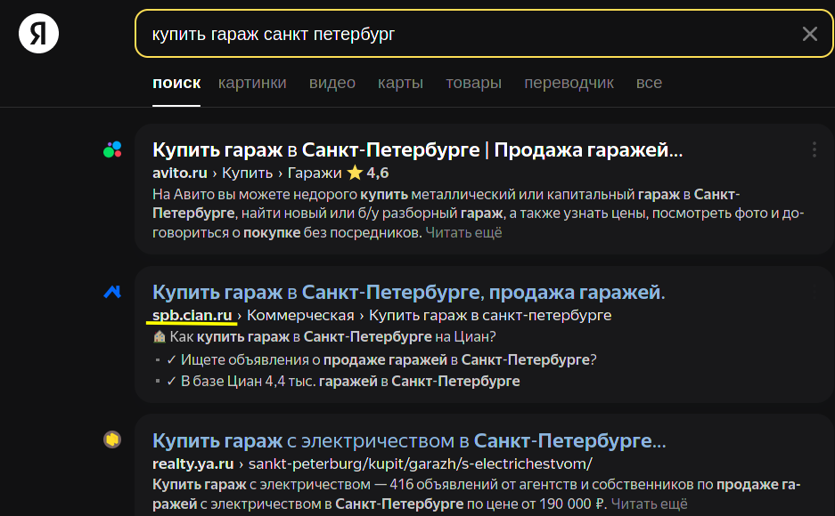

<h1 align="center">
Гибридное региональное продвижение без потерь и больших затрат
</h1>


&nbsp;&nbsp;&nbsp;&nbsp;На одном из недавних проектов снова встал вопрос регионального &nbsp;&nbsp;&nbsp;&nbsp;продвижения. Проект, уже имел региональный функционал на &nbsp;&nbsp;&nbsp;&nbsp;основе поддоменов. Но нас он не устраивал, об этом и как мы &nbsp;&nbsp;&nbsp;&nbsp;нашли **win-win** способ для поисковиков от **Yandex** и **Google**.

&nbsp;&nbsp;&nbsp;&nbsp;Не берусь судить об эффективности этого метода, он был опробован &nbsp;&nbsp;&nbsp;&nbsp;только на одном проекте и хотя это дало необходимые результаты - &nbsp;&nbsp;&nbsp;&nbsp;это не значит что это сработает и в вашей ситуации.

---

## Существующие подходы

> [!TIP]
> Вы можете пропускать разделы, знакомые вам и сразу перейти к моей [находке](#моя-находка-или-гибридный-подход), однако я вам рекомендую освежить память, а возможно и узнать что-то новое.

Здесь мы не будем рассматривать все подходы, например, подход с внедрением множества региональных ключевых слов в страницу мы обойдем стороной. Все рассматриваемые способы в этой статье - создают отдельный контент под конкретный город или регион.

### Доменная региональность


&nbsp;&nbsp;&nbsp;&nbsp;Возможно это самый популярный сейчас подход по региональному &nbsp;&nbsp;&nbsp;&nbsp;продвижению в СНГ.
Все это из-за популярности у нас поисковой &nbsp;&nbsp;&nbsp;&nbsp;системы от **Yandex**, который предоставляет функционал для &nbsp;&nbsp;&nbsp;&nbsp;определения региона доменна прямо из своей панели **Yandex &nbsp;&nbsp;&nbsp;&nbsp;webmaster**.

<br/>
<br/>
<br/>
<br/>

На данный момент, поисковик **Yandex** отдает предпочтение бизнесу, который закрепился локально в конкретном регионе. Конечно, не всем и не всегда, все зависит от качества и прочих переменных.
Но определенный прирост в этом есть, если использовать региональные ключи - можно получить гео-зависимые запросы.
Возможно вы уже видели сайт с похожими доменами:

- spb.website.ru
- krasnodar.website.ru
- volgograd.website.ru
- и другие

Такие веб-сайты используют как раз именно этот способ для регионального продвижения. <br/>
Приведу пример:

<p align="center">
  
  
</p>

Здесь я подчеркнул веб-сайты, которые как раз продвигаются этим способом, например **Cian.ru**. Однако мне повезло и на примерах видно и второй тип регионального продвижения - **Avito.ru** и **realty.ya.ru** используют [региональность на основе вложенности](#региональность-на-основе-вложенности).

### Региональность на основе вложенности

Есть несколько вариантов реализации данного подхода, например:

#### Версия №1 - Регион-директория

```graphql
/ # Главная страница
/about# О Веб-сайте / Гео-независимые страницы
/products # Предоставляемые услуги / товары
  ├─ /buy-sony-tv # Конкретный товар 1, содержащий ключевые слова по Москве
  └─ /buy-samsung-phone # Конкретный товар 2, содержащий ключевые слова по Москве
/spb
  ├─ / # Копия Главной страницы с обновленными региональными ключами
  ├─ /products
  │  ├─ /buy-sony-tv # Конкретный товар 1, содержащий ключевые слова по другому городу
  │  └─ /buy-samsung-phone # Конкретный товар 2, содержащий ключевые слова по другому городу
  └─ /about # Закрыто от индексации, чтобы не дублировать контент
/krasnodar
  ├─ / # Копия Главной страницы с обновленными региональными ключами
  ├─ /products
  │  ├─ /buy-sony-tv # Конкретный товар 1, содержащий ключевые слова по другому городу
  │  └─ /buy-samsung-phone # Конкретный товар 2, содержащий ключевые слова по другому городу
  └─ /about # Закрыто от индексации, чтобы не дублировать контент
```

#### Версия №2 - Регион как часть URL услуги

```graphql
/ # Главная страница
/about# О Веб-сайте / Гео-независимые страницы
/products # Предоставляемые услуги / товары
  ├─ /buy-sony-tv
  ├─ /buy-sony-tv-in-spb
  ├─ /buy-sony-tv-in-krasnodar
  └─ etc
```

### Моя находка или Гибридный подход

- В процессе

#### Настраиваем доменный подход

- В процессе

#### Настраиваем вложенный подход

- В процессе

## Итоги

Надеюсь, после моего рассказа гибридное региональное продвижение перестанет быть для вас чем то радикальным или диким.

**Уважаемые читатели!** Известно ли вам что-то такое о региональном, о чём мало кто знает?, если так - просим поделиться своим мнением.
